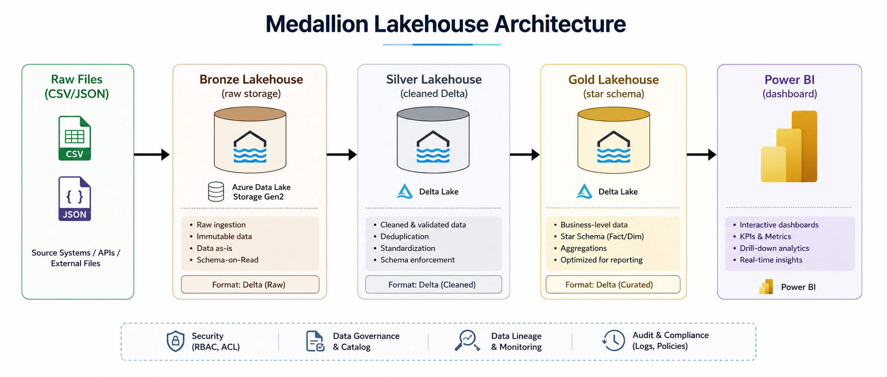
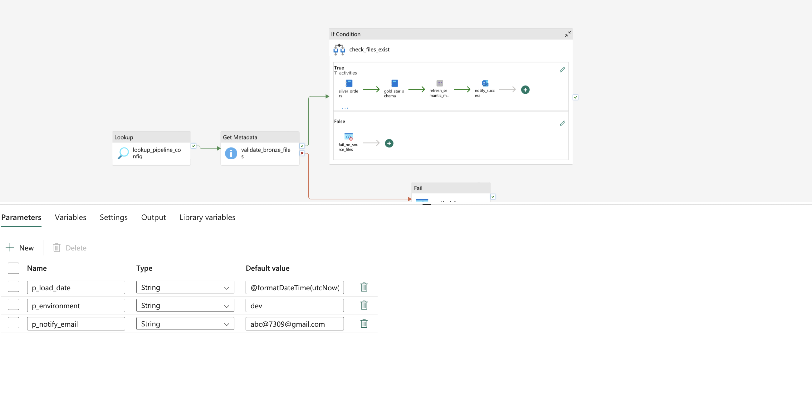
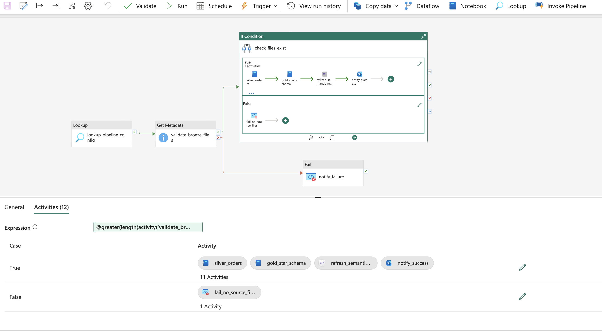
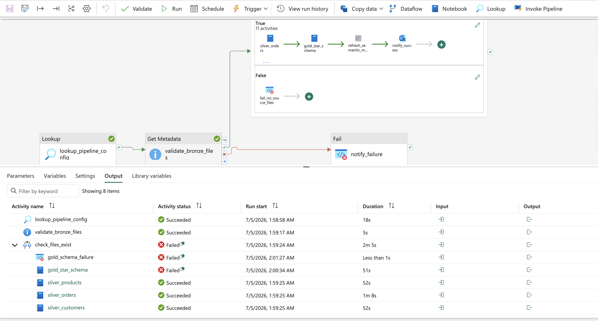
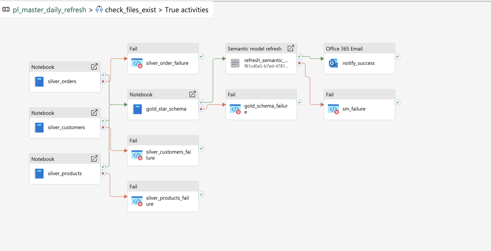
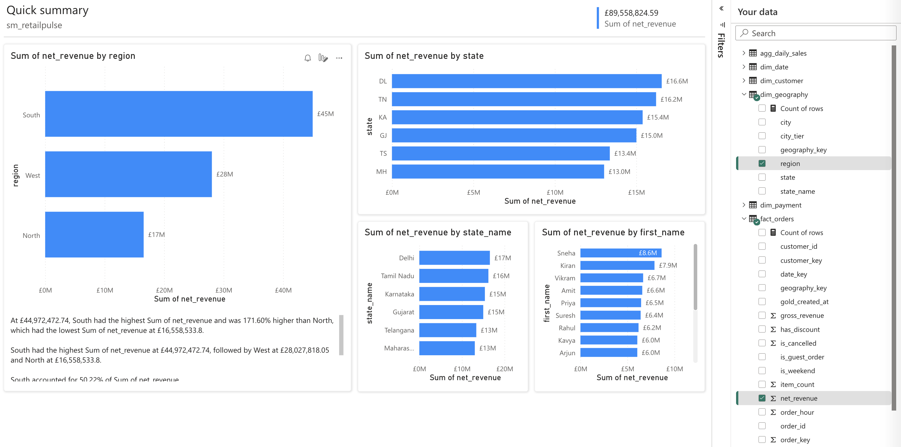
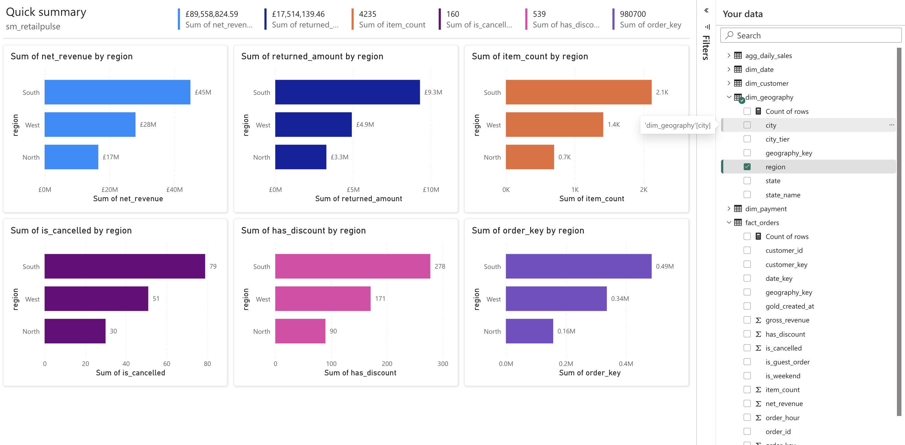
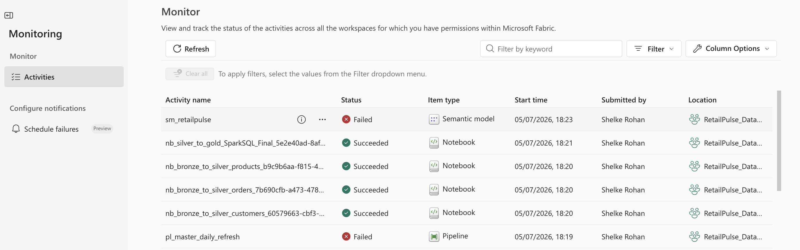
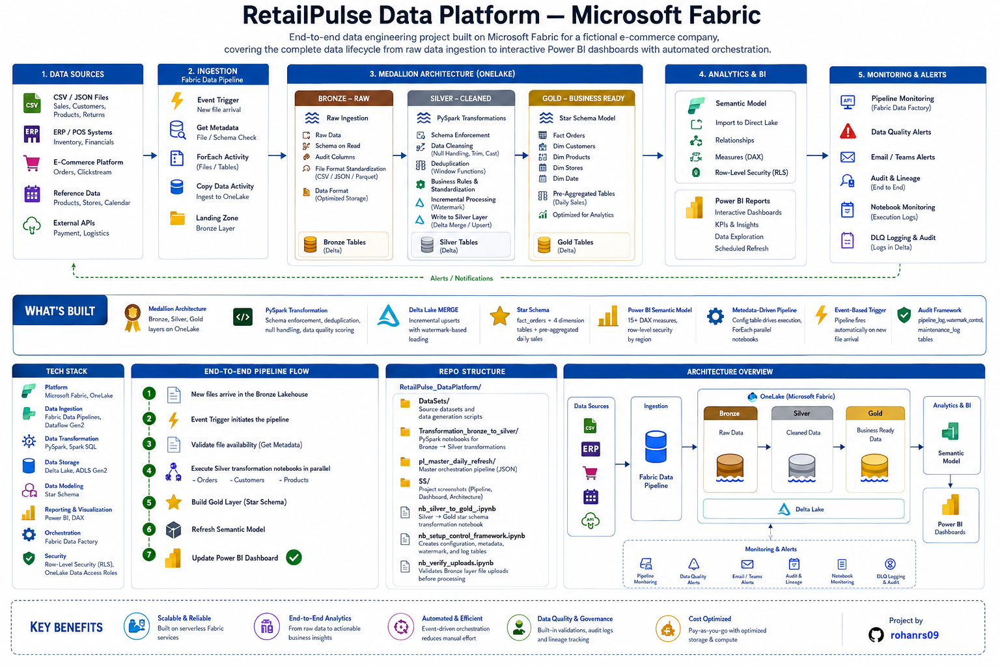

# RetailPulse Data Platform — Microsoft Fabric

End-to-end data engineering project built on Microsoft Fabric for a fictional e-commerce company, covering the complete data lifecycle from raw data ingestion to interactive Power BI dashboards with automated orchestration.

## 🏗️ End-to-End Architecture

<p align="center">
  
</p>

## What's Built

- **Medallion Architecture** — Bronze, Silver, Gold layers on OneLake
- **PySpark Transformation** — schema enforcement, deduplication, null handling, data quality scoring
- **Delta Lake MERGE** — incremental upserts with watermark-based loading
- **Star Schema** — fact_orders + 4 dimension tables + pre-aggregated daily sales
- **Power BI Semantic Model** — 15+ DAX measures, row-level security by region
- **Metadata-Driven Pipeline** — config table drives execution, ForEach parallel notebooks
- **Event-Based Trigger** — pipeline fires automatically on new file arrival
- **Audit Framework** — pipeline_log, watermark_control, maintenance_log tables

## 📁 Repo Structure

```text
RetailPulse_DataPlatform/
│
├── DataSets/                          # Source datasets and data generation scripts
├── Transformation_bronze_to_silver/   # PySpark notebooks for Bronze → Silver transformations
├── pl_master_daily_refresh/           # Master orchestration pipeline (JSON)
├── SS/                                # Project screenshots (Pipeline, Dashboard, Architecture)
│
├── nb_silver_to_gold_.ipynb            # Silver → Gold star schema transformation notebook
├── nb_setup_control_framework.ipynb   # Creates configuration, metadata, watermark, and log tables
└── nb_verify_uploads.ipynb            # Validates Bronze layer file uploads before processing
```

## 🛠️ Tech Stack

| **Category** | **Technology** |
|---------------|----------------|
| **Platform** | Microsoft Fabric, OneLake |
| **Data Ingestion** | Fabric Data Pipelines, Dataflow Gen2 |
| **Data Transformation** | PySpark, Spark SQL |
| **Data Storage** | Delta Lake, ADLS Gen2 |
| **Data Modeling** | Star Schema |
| **Reporting & Visualization** | Power BI, DAX |
| **Orchestration** | Fabric Data Factory |
| **Security** | Row-Level Security (RLS), OneLake Data Access Roles |

---

## 🔄 Pipeline Flow

```text
New files arrive in the Bronze Lakehouse
                │
                ▼
Event Trigger initiates the pipeline
                │
                ▼
Validate file availability (Get Metadata)
                │
                ▼
Execute Silver transformation notebooks in parallel
   ├── Orders
   ├── Customers
   └── Products
                │
                ▼
Build Gold Layer (Star Schema)
                │
                ▼
Refresh Semantic Model
                │
                ▼
Update Power BI Dashboard ✅
```

## Pipelines Design Screenshots

Pipeline flow, Power BI dashboard, and architecture diagrams are in the `SS/` folder.

## ⚙️ Pipeline Design

### Pipeline Overview

<p align="center">
  
</p>


<p align="center">
  
</p>

### Pipeline Execution

<p align="center">
  
</p>

## 📓 Notebook Execution

<p align="center">
  
</p>

## 📊 Power BI Dashboard

### Sales & Business Dashboard

<p align="center">
  
</p>

### Customer & Product Analytics

<p align="center">
  
</p>

---

## 🔍 Pipeline Monitoring

<p align="center">
  
</p>

# END TO END WORKFLOW

<p align="center">
  
</p>


## Key Problems Solved

- Source data had inconsistent city names, messy booleans, mixed data types — fixed in Silver layer
- `.save()` vs `.saveAsTable()` — semantic model requires registered tables, not just Delta files
- Parallel Silver execution reduces total pipeline runtime significantly
- Watermark pattern ensures only new records processed — no full reloads
